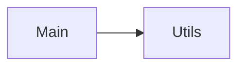

Repository Summary:
Files analyzed: 27
Directories scanned: 98
Total size: 16.65 KB (17052 bytes)
Estimated tokens: 4263
Processing time: 0.15 seconds


## Table of Contents

- [Project Summary](#project-summary)
- [Directory Structure](#directory-structure)
- [Files Content](#files-content)
  - Files By Category:
    - Configuration (25 files):
      - [Chart.yaml](#Chart_yaml) - 161 bytes
      - [Chart.yaml](#Chart_yaml) - 434 bytes
      - [Chart.yaml](#Chart_yaml) - 363 bytes
      - [deployment.yaml](#deployment_yaml) - 2.5 KB
      - [dev.yaml](#dev_yaml) - 257 bytes
      - [dev.yaml](#dev_yaml) - 570 bytes
      - [dev.yaml](#dev_yaml) - 345 bytes
      - [hpa.yaml](#hpa_yaml) - 823 bytes
      - [ingress.yaml](#ingress_yaml) - 915 bytes
      - [prepare-storage.yaml](#prepare-storage_yaml) - 855 bytes
      - [and 15 more Configuration files...]
    - Other (2 files):
      - [.helmignore](#_helmignore) - 48 bytes
      - [needed_envs](#needed_envs) - 268 bytes
- [Architecture and Relationships](#architecture-and-relationships)
  - [File Dependencies](#file-dependencies)
  - [Class Relationships](#class-relationships)
  - [Component Interactions](#component-interactions)

## Project Summary <a id="project-summary"></a>

# Project Digest: newsapp-manifests
Generated on: Fri Aug 15 2025 01:19:57 GMT+0300 (Israel Daylight Time)
Source: c:\Users\Eli\newsapp\newsapp-manifests
Project Directory: c:\Users\Eli\newsapp\newsapp-manifests

# Directory Structure
[DIR] .
  [DIR] .git
  [DIR] .vscode
  [DIR] charts
    [DIR] app
      [FILE] .helmignore
      [FILE] Chart.yaml
      [DIR] templates
        [FILE] deployment.yaml
        [FILE] hpa.yaml
        [FILE] ingress.yaml
        [FILE] service.yaml
      [FILE] values.yaml
    [DIR] newsapp
      [FILE] Chart.yaml
      [FILE] values.yaml
    [DIR] postgresql
      [FILE] Chart.yaml
      [DIR] templates
        [FILE] prepare-storage.yaml
        [FILE] pv.yaml
        [FILE] pvc.yaml
        [FILE] service.yaml
        [FILE] statefulset.yaml
      [FILE] values.yaml
  [DIR] clusters
    [DIR] dev
      [DIR] apps
        [FILE] stack.yaml
      [FILE] project.yaml
    [DIR] prod
      [DIR] apps
        [FILE] stack.yaml
      [FILE] project.yaml
  [DIR] CodeFlattened_Output
  [FILE] needed_envs
  [DIR] sealed
    [DIR] backend
      [DIR] dev
      [DIR] prod
  [DIR] values
    [DIR] backend
      [FILE] dev.yaml
      [FILE] prod.yaml
    [DIR] frontend
      [FILE] dev.yaml
      [FILE] prod.yaml
    [DIR] postgresql
      [FILE] dev.yaml
      [FILE] prod.yaml

# Files Content

## charts\app\.helmignore <a id="helmignore"></a>

.git/
.github/
.vscode/
*.swp
*.bak
*.tmp

## charts\app\Chart.yaml <a id="Chart_yaml"></a>

apiVersion: v2
name: app
description: Generic deployment chart for simple web apps (backend/frontend)
type: application
version: 0.1.0
appVersion: "1.0.0"

## charts\app\templates\deployment.yaml <a id="deployment_yaml"></a>

### Dependencies

- `{{ .Values.image.repository }}:{{ .Values.image.tag }}`

apiVersion: apps/v1
kind: Deployment
metadata:
  name: {{ include "app.fullname" . }}
  labels:
    app.kubernetes.io/name: {{ include "app.name" . }}
  annotations:
    {{- /* Sync waves: backend=1, frontend=2 */ -}}
    {{- $wave := "1" -}}
    {{- if eq .Values.app.type "frontend" }}{{- $wave = "2" }}{{- end }}
    argocd.argoproj.io/sync-wave: "{{ $wave }}"
spec:
  replicas: {{ .Values.replicaCount }}
  selector:
    matchLabels:
      app.kubernetes.io/name: {{ include "app.name" . }}
  template:
    metadata:
      labels:
        app.kubernetes.io/name: {{ include "app.name" . }}
    spec:
      {{- if .Values.imagePullSecrets }}
      imagePullSecrets:
{{ toYaml .Values.imagePullSecrets | indent 8 }}
      {{- end }}
      {{- if .Values.nodeSelector }}
      nodeSelector:
{{ toYaml .Values.nodeSelector | indent 8 }}
      {{- end }}
      {{- if .Values.tolerations }}
      tolerations:
{{ toYaml .Values.tolerations | indent 8 }}
      {{- end }}
      {{- if .Values.affinity }}
      affinity:
{{ toYaml .Values.affinity | indent 8 }}
      {{- end }}
      containers:
        - name: {{ include "app.name" . }}
          image: "{{ .Values.image.repository }}:{{ .Values.image.tag }}"
          imagePullPolicy: {{ .Values.image.pullPolicy }}
          ports:
            - containerPort: {{ .Values.service.port }}
              name: http
              {{- if .Values.service.hostPort }}
              hostPort: {{ .Values.service.hostPort }}
              {{- end }}
          # Always pass the pod's namespace (used by FE nginx entrypoint for backend DNS)
          env:
            - name: POD_NAMESPACE
              valueFrom:
                fieldRef:
                  fieldPath: metadata.namespace
            {{- range $k, $v := .Values.env.plain }}
            - name: {{ $k }}
              value: "{{ $v }}"
            {{- end }}
          {{- if or .Values.env.secretRef .Values.env.configRef }}
          envFrom:
            {{- if .Values.env.configRef }}
            - configMapRef: { name: {{ .Values.env.configRef }} }
            {{- end }}
            {{- if .Values.env.secretRef }}
            - secretRef: { name: {{ .Values.env.secretRef }} }
            {{- end }}
          {{- end }}
          {{- if .Values.securityContext.addNetBindService }}
          securityContext:
            capabilities: { add: ["NET_BIND_SERVICE"] }
          {{- end }}
          resources:
{{ toYaml .Values.resources | indent 12 }}

## charts\newsapp\Chart.yaml <a id="Chart_yaml"></a>

apiVersion: v2
name: newsapp
description: Umbrella chart for frontend + backend + postgresql
type: application
version: 0.1.0
appVersion: "1.0.0"

dependencies:
  - name: app
    alias: backend
    repository: "file://../app"
    version: "0.1.0"
  - name: app
    alias: frontend
    repository: "file://../app"
    version: "0.1.0"
  - name: postgresql
    repository: "file://../postgresql"
    version: "0.1.0"

## values\backend\dev.yaml <a id="dev_yaml"></a>

app: {name: backend, type: backend}
fullnameOverride: backend
image:
  repository: elipavlov/newsapp-backend
  tag: latest-6b42e0e
service:
  type: ClusterIP
  port: 8080
env:
  plain:
    DB_ENGINE_TYPE: "POSTGRES"
  secretRef: backend-secrets

## charts\postgresql\Chart.yaml <a id="Chart_yaml"></a>

image:
  repository: postgres
  tag: "16-alpine"
  pullPolicy: IfNotPresent

postgresql:
  port: 5432
  secretName: postgres-credentials  # keys: POSTGRES_DB, POSTGRES_USER, POSTGRES_PASSWORD

persistence:
  enabled: true
  storageClass: ""
  size: 10Gi

nodeSelector: {}
tolerations: []
affinity: {}

service:
  type: ClusterIP
  port: 5432

## values\frontend\dev.yaml <a id="dev_yaml"></a>

app: {name: frontend, type: frontend}
image:
  repository: elipavlov/newsapp-frontend
  tag: latest-ee2e95e
service:
  type: NodePort
  port: 80
  nodePort: 30080
nodeSelector: {kubernetes.io/hostname: node-1}
securityContext:
  addNetBindService: true
env:
  plain:
    VITE_SERVER_URL: "/api"                 # (build-time in CI, here for doc)
    VITE_NEWS_INTERVAL_IN_MIN: "5"          # (build-time in CI, here for doc)
    BACKEND_SERVICE_HOST: ""                # filled by CI step
    BACKEND_SERVICE_PORT: ""                # filled by CI step

## values\postgresql\dev.yaml <a id="dev_yaml"></a>

# values/postgresql/dev.yaml (consumed by charts/newsapp)
postgresql:
  image:
    repository: postgres
    tag: "16-alpine"
  postgresql:
    port: 5432
    secretName: postgres-credentials
  persistence:
    enabled: true
    size: 5Gi
    existingClaim: postgresql-pvc-development
  service:
    type: ClusterIP
    port: 5432

## charts\app\templates\hpa.yaml <a id="hpa_yaml"></a>

{{- if .Values.hpa.enabled }}
apiVersion: autoscaling/v2
kind: HorizontalPodAutoscaler
metadata:
  name: {{ include "app.fullname" . }}
spec:
  scaleTargetRef:
    apiVersion: apps/v1
    kind: Deployment
    name: {{ include "app.fullname" . }}
  minReplicas: {{ .Values.hpa.minReplicas }}
  maxReplicas: {{ .Values.hpa.maxReplicas }}
  metrics:
    - type: Resource
      resource:
        name: cpu
        target:
          type: Utilization
          averageUtilization: {{ .Values.hpa.targetCPUUtilizationPercentage }}
    {{- if .Values.hpa.targetMemoryUtilizationPercentage }}
    - type: Resource
      resource:
        name: memory
        target:
          type: Utilization
          averageUtilization: {{ .Values.hpa.targetMemoryUtilizationPercentage }}
    {{- end }}
{{- end }}

## charts\app\templates\ingress.yaml <a id="ingress_yaml"></a>

{{- if and (hasKey .Values "ingress") (.Values.ingress.enabled) }}
apiVersion: networking.k8s.io/v1
kind: Ingress
metadata:
  name: {{ include "app.fullname" . }}
  {{- with .Values.ingress.annotations }}
  annotations:
    {{- toYaml . | nindent 4 }}
  {{- end }}
spec:
  {{- with .Values.ingress.className }}
  ingressClassName: {{ . }}
  {{- end }}
  rules:
    {{- range .Values.ingress.hosts }}
    - host: {{ .host | quote }}
      http:
        paths:
          {{- range .paths }}
          - path: {{ .path }}
            pathType: {{ .pathType | default "Prefix" }}
            backend:
              service:
                name: {{ include "app.fullname" $ }}
                port:
                  number: {{ $.Values.service.port }}
          {{- end }}
    {{- end }}
  {{- with .Values.ingress.tls }}
  tls:
    {{- toYaml . | nindent 4 }}
  {{- end }}
{{- end }}

## needed_envs <a id="needed_envs"></a>

VITE_SERVER_URL= {{VITE_SERVER_URL}}
VITE_NEWS_INTERVAL_IN_MIN= {{VITE_NEWS_INTERVAL_IN_MIN}}
# MONGO | MONGOOSE | POSTGRES | MYSQL
DB_ENGINE_TYPE={{DB_ENGINE_TYPE}}
# connection string : [protocol]://[username]:[password]@[host]/[database name]
DB_URI={{DB_URI}}
## values\backend\prod.yaml <a id="prod_yaml"></a>

app: {name: backend, type: backend}
fullnameOverride: backend
image:
  repository: elipavlov/newsapp-backend
  tag: latest-6b42e0e
service:
  type: ClusterIP
  port: 8080
env:
  plain:
    DB_ENGINE_TYPE: "POSTGRES"
  secretRef: backend-secrets

## values\postgresql\prod.yaml <a id="prod_yaml"></a>

nodeSelector:
  kubernetes.io/hostname: node-3

postgresql:
  secretName: postgres-credentials

persistence:
  enabled: true
  existingClaim: postgresql-pvc-default
  size: 20Gi

service:
  type: ClusterIP
  port: 5432

## values\frontend\prod.yaml <a id="prod_yaml"></a>

app: {name: frontend, type: frontend}
image:
  repository: elipavlov/newsapp-frontend
  tag: latest-ee2e95e
service:
  type: ClusterIP
  port: 80
nodeSelector: {kubernetes.io/hostname: node-1}
securityContext:
  addNetBindService: true
env:
  plain:
    VITE_SERVER_URL: "/api"                 # (build-time in CI, here for doc)
    VITE_NEWS_INTERVAL_IN_MIN: "5"          # (build-time in CI, here for doc)
    BACKEND_SERVICE_HOST: ""
    BACKEND_SERVICE_PORT: ""

ingress:
  enabled: true
  className: nginx
  annotations:
    nginx.ingress.kubernetes.io/rewrite-target: /$1
  hosts:
    - host: news.example.com
      paths:
        - path: /(.*)
          pathType: Prefix
  tls:
    - hosts: ["news.example.com"]
      secretName: newsapp-tls

## charts\postgresql\templates\prepare-storage.yaml <a id="prepare-storage_yaml"></a>

### Dependencies

- `alpine:3.20`

apiVersion: batch/v1
kind: Job
metadata:
  name: postgresql-prepare-storage
  labels:
    app.kubernetes.io/name: postgresql
spec:
  backoffLimit: 2
  template:
    spec:
      restartPolicy: OnFailure
{{- if .Values.nodeSelector }}
      nodeSelector:
{{ toYaml .Values.nodeSelector | indent 8 }}
{{- end }}
      containers:
        - name: mkdir
          image: alpine:3.20
          command: ["/bin/sh","-c"]
          args:
            - |
              set -e
              mkdir -p /mnt/data/postgresql-{{ .Release.Namespace }}
              echo "Ensured /mnt/data/postgresql-{{ .Release.Namespace }}"
          volumeMounts:
            - name: host-mnt
              mountPath: /mnt/data
      volumes:
        - name: host-mnt
          hostPath:
            path: /mnt/data
            type: DirectoryOrCreate

## clusters\dev\project.yaml <a id="project_yaml"></a>

apiVersion: argoproj.io/v1alpha1
kind: AppProject
metadata:
  name: newsapp-dev
  namespace: argocd
spec:
  description: Development project for newsapp
  sourceRepos:
    - https://github.com/eli-pavlov/newsapp-manifests.git
  destinations:
    - namespace: development
      server: https://kubernetes.default.svc
  clusterResourceWhitelist:
    - group: '*'
      kind: '*'
  namespaceResourceWhitelist:
    - group: '*'
      kind: '*'

## charts\app\templates\service.yaml <a id="service_yaml"></a>

apiVersion: v1
kind: Service
metadata:
  name: {{ include "app.fullname" . }}
  labels:
    app.kubernetes.io/name: {{ include "app.name" . }}
  annotations:
    {{- /* Sync waves: backend=1, frontend=2 */ -}}
    {{- $wave := "1" -}}
    {{- if eq .Values.app.type "frontend" }}{{- $wave = "2" }}{{- end }}
    argocd.argoproj.io/sync-wave: "{{ $wave }}"
spec:
  type: {{ .Values.service.type }}
  selector:
    app.kubernetes.io/name: {{ include "app.name" . }}
  ports:
    - name: http
      port: {{ .Values.service.port }}
      targetPort: {{ .Values.service.port }}
      {{- if and (eq .Values.service.type "NodePort") .Values.service.nodePort }}
      nodePort: {{ .Values.service.nodePort }}
      {{- end }}

## clusters\prod\project.yaml <a id="project_yaml"></a>

apiVersion: argoproj.io/v1alpha1
kind: AppProject
metadata:
  name: newsapp-prod
  namespace: argocd
spec:
  description: Production project for newsapp
  sourceRepos:
    - https://github.com/eli-pavlov/newsapp-manifests.git
  destinations:
    - namespace: default
      server: https://kubernetes.default.svc
  clusterResourceWhitelist:
    - group: '*'
      kind: '*'
  namespaceResourceWhitelist:
    - group: '*'
      kind: '*'

## charts\postgresql\templates\pv.yaml <a id="pv_yaml"></a>

apiVersion: v1
kind: PersistentVolume
metadata:
  name: postgresql-pv-{{ .Release.Namespace }}
  labels:
    app.kubernetes.io/name: postgresql
spec:
  capacity:
    storage: {{ .Values.persistence.size | default "10Gi" }}
  accessModes: ["ReadWriteOnce"]
  storageClassName: local-path
  local:
    path: /mnt/data/postgresql-{{ .Release.Namespace }}
  nodeAffinity:
    required:
      nodeSelectorTerms:
        - matchExpressions:
            - key: kubernetes.io/hostname
              operator: In
              values:
                {{- if and .Values.nodeSelector (hasKey .Values.nodeSelector "kubernetes.io/hostname") }}
                - {{ index .Values.nodeSelector "kubernetes.io/hostname" | quote }}
                {{- else }}
                - "node-3"
                {{- end }}

## charts\postgresql\templates\pvc.yaml <a id="pvc_yaml"></a>

apiVersion: v1
kind: PersistentVolumeClaim
metadata:
  name: {{ .Values.persistence.existingClaim | default (printf "postgresql-pvc-%s" .Release.Namespace) }}
spec:
  accessModes: ["ReadWriteOnce"]
  resources:
    requests:
      storage: {{ .Values.persistence.size | default "10Gi" }}
  storageClassName: local-path
  volumeName: postgresql-pv-{{ .Release.Namespace }}

## charts\postgresql\templates\service.yaml <a id="service_yaml"></a>

apiVersion: v1
kind: Service
metadata:
  name: postgresql
  labels:
    app.kubernetes.io/name: postgresql
spec:
  type: {{ .Values.service.type }}
  selector:
    app.kubernetes.io/name: postgresql
  ports:
    - name: postgresql
      port: {{ .Values.service.port }}
      targetPort: 5432

## charts\app\values.yaml <a id="values_yaml"></a>

app:
  name: app
  type: backend # or "frontend"

image:
  repository: ""
  tag: "latest"
  pullPolicy: IfNotPresent

replicaCount: 1

service:
  type: ClusterIP   # ClusterIP | NodePort
  port: 80          # container & service port for the app
  nodePort: null    # e.g. 30001 for backend
  hostPort: null    # e.g. 80 for prod FE, 3080 for dev FE

resources: {}

nodeSelector: {}
tolerations: []
affinity: []

imagePullSecrets: []

env:
  plain: {}       # e.g. VITE_* or DB_ENGINE_TYPE
  secretRef: ""   # e.g. backend-secrets (DB_URI)
  configRef: ""

securityContext:
  addNetBindService: false # needed if binding <1024 like port 80 as non-root

ingress:
  enabled: false
  className: ""
  annotations: {}
  hosts: []   # example when enabled:
  # - host: example.com
  #   paths:
  #     - path: /
  #       pathType: Prefix
  tls: []

## clusters\prod\apps\stack.yaml <a id="stack_yaml"></a>

apiVersion: argoproj.io/v1alpha1
kind: Application
metadata:
  name: newsapp-prod
  namespace: argocd
spec:
  project: newsapp-prod
  destination:
    server: https://kubernetes.default.svc
    namespace: default
  sources:
    # 0) SealedSecrets (namespace-scoped to "default")
    - repoURL: https://github.com/eli-pavlov/newsapp-manifests.git
      targetRevision: main
      path: sealed/backend/prod
      directory:
        recurse: true

    # 1) Umbrella chart (deploys postgresql + backend + frontend)
    - repoURL: https://github.com/eli-pavlov/newsapp-manifests.git
      targetRevision: main
      path: charts/newsapp
      helm:
        releaseName: newsapp
        valueFiles:
          - values/postgresql/prod.yaml
          - values/backend/prod.yaml
          - values/frontend/prod.yaml

  syncPolicy:
    automated:
      prune: true
      selfHeal: true
    syncOptions:
      - CreateNamespace=true
      - ApplyOutOfSyncOnly=true
      - RespectIgnoreDifferences=true

## charts\postgresql\templates\statefulset.yaml <a id="statefulset_yaml"></a>

### Dependencies

- `{{ .Values.image.repository }}:{{ .Values.image.tag }}`

apiVersion: apps/v1
kind: StatefulSet
metadata:
  name: postgresql
  labels:
    app.kubernetes.io/name: postgresql
spec:
  serviceName: postgresql
  replicas: 1
  selector:
    matchLabels:
      app.kubernetes.io/name: postgresql
  template:
    metadata:
      labels:
        app.kubernetes.io/name: postgresql
    spec:
{{- if .Values.nodeSelector }}
      nodeSelector:
{{ toYaml .Values.nodeSelector | indent 8 }}
{{- end }}
      containers:
        - name: postgresql
          image: {{ .Values.image.repository }}:{{ .Values.image.tag }}
          imagePullPolicy: {{ .Values.image.pullPolicy }}
          env:
            - name: POSTGRES_DB
              valueFrom: { secretKeyRef: { name: {{ .Values.postgresql.secretName | quote }}, key: POSTGRES_DB } }
            - name: POSTGRES_USER
              valueFrom: { secretKeyRef: { name: {{ .Values.postgresql.secretName | quote }}, key: POSTGRES_USER } }
            - name: POSTGRES_PASSWORD
              valueFrom: { secretKeyRef: { name: {{ .Values.postgresql.secretName | quote }}, key: POSTGRES_PASSWORD } }
          ports:
            - containerPort: 5432
              name: postgresql
          volumeMounts:
            - name: data
              mountPath: /var/lib/postgresql/data
{{- if .Values.persistence.existingClaim }}
      volumes:
        - name: data
          persistentVolumeClaim:
            claimName: {{ .Values.persistence.existingClaim }}
{{- else }}
  volumeClaimTemplates:
    - metadata:
        name: data
      spec:
        accessModes: ["ReadWriteOnce"]
        resources:
          requests:
            storage: {{ .Values.persistence.size | default "10Gi" }}
        storageClassName: local-path
{{- end }}

## clusters\dev\apps\stack.yaml <a id="stack_yaml"></a>

apiVersion: argoproj.io/v1alpha1
kind: Application
metadata:
  name: newsapp-dev
  namespace: argocd
spec:
  project: newsapp-dev
  destination:
    server: https://kubernetes.default.svc
    namespace: development
  sources:
    # 0) SealedSecrets (namespace-scoped to "development")
    - repoURL: https://github.com/eli-pavlov/newsapp-manifests.git
      targetRevision: main
      path: sealed/backend/dev
      directory:
        recurse: true

    # 1) Umbrella chart (deploys postgresql + backend + frontend)
    - repoURL: https://github.com/eli-pavlov/newsapp-manifests.git
      targetRevision: main
      path: charts/newsapp
      helm:
        releaseName: newsapp
        valueFiles:
          - values/postgresql/dev.yaml
          - values/backend/dev.yaml
          - values/frontend/dev.yaml

  syncPolicy:
    automated:
      prune: true
      selfHeal: true
    syncOptions:
      - CreateNamespace=true
      - ApplyOutOfSyncOnly=true
      - RespectIgnoreDifferences=true

## charts\newsapp\values.yaml <a id="values_yaml"></a>

# Intentionally empty; we pass env-specific value files from Argo CD.

## charts\postgresql\values.yaml <a id="values_yaml"></a>

# charts/postgresql/values.yaml
image:
  repository: postgres
  tag: "16-alpine"
postgresql:
  port: 5432
  secretName: postgres-credentials
persistence:
  enabled: true
  size: 10Gi
service:
  type: ClusterIP
  port: 5432
## Code Visualization


### Architecture and Relationships

These diagrams visualize code relationships at different levels of abstraction.

### File Dependencies

This diagram shows dependencies between individual source files.

#

Below is a visualization of file dependencies in the codebase:

```mermaid
graph LR
  F1_c:\Users\Eli\newsapp\newsapp-manifests\charts\app_.helmignore[".helmignore"]
  F2_c:\Users\Eli\newsapp\newsapp-manifests\charts\app_Chart.yaml["Chart.yaml"]
  F3_c:\Users\Eli\newsapp\newsapp-manifests\charts\app\templates_deployment.yaml["deployment.yaml"]
  F4_c:\Users\Eli\newsapp\newsapp-manifests\charts\newsapp_Chart.yaml["Chart.yaml"]
  F5_c:\Users\Eli\newsapp\newsapp-manifests\charts\postgresql_Chart.yaml["Chart.yaml"]
  F6_c:\Users\Eli\newsapp\newsapp-manifests\values\backend_dev.yaml["dev.yaml"]
  F7_c:\Users\Eli\newsapp\newsapp-manifests\values\frontend_dev.yaml["dev.yaml"]
  F8_c:\Users\Eli\newsapp\newsapp-manifests\values\postgresql_dev.yaml["dev.yaml"]
  F9_c:\Users\Eli\newsapp\newsapp-manifests\charts\app\templates_hpa.yaml["hpa.yaml"]
  F10_c:\Users\Eli\newsapp\newsapp-manifests\charts\app\templates_ingress.yaml["ingress.yaml"]
  F11_c:\Users\Eli\newsapp\newsapp-manifests_needed_envs["needed_envs"]
  F12_c:\Users\Eli\newsapp\newsapp-manifests\values\backend_prod.yaml["prod.yaml"]
  F13_c:\Users\Eli\newsapp\newsapp-manifests\values\postgresql_prod.yaml["prod.yaml"]
  F14_c:\Users\Eli\newsapp\newsapp-manifests\values\frontend_prod.yaml["prod.yaml"]
  F15_c:\Users\Eli\newsapp\newsapp-manifests\charts\postgresql\templates_prepare-storage.yaml["prepare-storage.yaml"]
  F16_c:\Users\Eli\newsapp\newsapp-manifests\clusters\dev_project.yaml["project.yaml"]
  F17_c:\Users\Eli\newsapp\newsapp-manifests\clusters\prod_project.yaml["project.yaml"]
  F18_c:\Users\Eli\newsapp\newsapp-manifests\charts\app\templates_service.yaml["service.yaml"]
  F19_c:\Users\Eli\newsapp\newsapp-manifests\charts\postgresql\templates_pv.yaml["pv.yaml"]
  F20_c:\Users\Eli\newsapp\newsapp-manifests\charts\postgresql\templates_service.yaml["service.yaml"]
  F21_c:\Users\Eli\newsapp\newsapp-manifests\charts\postgresql\templates_pvc.yaml["pvc.yaml"]
  F22_c:\Users\Eli\newsapp\newsapp-manifests\charts\app_values.yaml["values.yaml"]
  F23_c:\Users\Eli\newsapp\newsapp-manifests\clusters\prod\apps_stack.yaml["stack.yaml"]
  F24_c:\Users\Eli\newsapp\newsapp-manifests\charts\postgresql\templates_statefulset.yaml["statefulset.yaml"]
  F25_c:\Users\Eli\newsapp\newsapp-manifests\clusters\dev\apps_stack.yaml["stack.yaml"]
  F26_c:\Users\Eli\newsapp\newsapp-manifests\charts\newsapp_values.yaml["values.yaml"]
  F27_c:\Users\Eli\newsapp\newsapp-manifests\charts\postgresql_values.yaml["values.yaml"]
```



### Class Relationships

This diagram shows inheritance and associations between classes.

```mermaid
classDiagram
```




<!-- TEST VISUALIZATION MARKER -->


